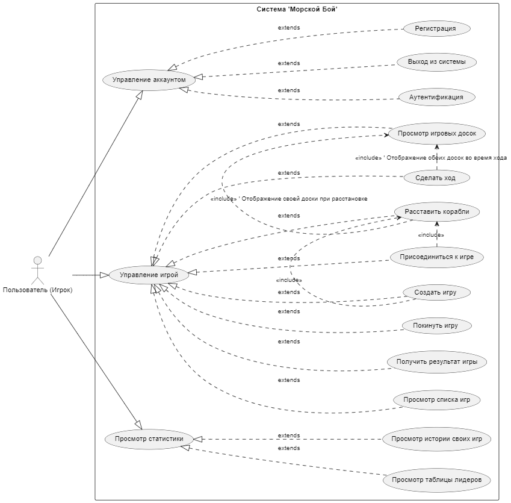

# 2. Пользователи и бизнес-процессы

## 2.1. Пользователи (Роли)

*   **Игрок (Player):** Основной пользователь системы. Может регистрироваться, входить в систему, создавать игры, присоединяться к играм, вручную расставлять корабли на своем поле, подтверждать готовность, делать ходы, просматривать историю своих игр и общую таблицу лидеров (рейтинг игроков).

### Диаграмма вариантов использования

## 2.2. Бизнес-процессы (Основные сценарии использования)

### 2.2.1. Регистрация и Аутентификация
*   **Регистрация нового игрока:** Пользователь вводит имя пользователя и пароль для создания учетной записи.
*   **Вход в систему:** Зарегистрированный пользователь входит в систему, используя свои учетные данные.
*   **Выход из системы:** Пользователь завершает сеанс работы с приложением.

### 2.2.2. Управление играми в Лобби
*   **Создание новой игры:** Игрок создает новую игру. Игра появляется в списке открытых лобби.
*   **Присоединение к существующей игре:** Игрок выбирает из списка доступных игр в лобби и присоединяется к ней.
*   **Просмотр списка доступных игр:** Игрок видит список игр, ожидающих второго игрока.
*   **Просмотр истории своих игр:** Игрок может просмотреть список сыгранных им ранее игр с указанием противника, результата и даты игры.
*   **Просмотр таблицы лидеров:** Игроки могут видеть рейтинг (топ N игроков) с указанием количества побед, поражений, общего числа игр и текущего рейтинга.

#### Диаграмма последовательности создания игры

.png)

### 2.2.3. Игровой процесс
*   **Этап расстановки кораблей:**
    *   После создания/присоединения к игре, если оба игрока в игре, каждый игрок переходит к экрану расстановки кораблей.
    *   Игрок вручную размещает свой стандартный флот (например, 1x4, 2x3, 3x2, 4x1 клетки) на своем 10x10 поле. Предоставляется интерфейс для выбора корабля, его ориентации (горизонтальная/вертикальная) и размещения на доске.
    *   Реализована базовая валидация на стороне клиента (корабли не выходят за пределы поля, не пересекаются).
    *   После завершения расстановки игрок подтверждает ее.

#### Диаграмма последовательности игрового процесса

.png)

*   **Этап ожидания готовности:**
    *   После того как оба игрока подтвердили расстановку своих кораблей, они должны подтвердить свою готовность начать бой.
    *   Игра не начнется, пока оба игрока не будут готовы.
*   **Бой:**
    *   Система определяет, какой игрок ходит первым (например, создатель игры или случайно).
    *   **Совершение хода:** Активный игрок выбирает ячейку на поле противника для выстрела.
    *   **Обработка результата хода:** Система информирует обоих игроков о результате выстрела (промах, попадание, потопил корабль). Информация обновляется на игровых досках.
    *   **Передача хода:** Ход передается другому игроку после промаха. При попадании игрок продолжает ходить.
*   **Завершение игры:**
    *   Игра завершается, когда один из игроков теряет все свои корабли.
    *   Система объявляет победителя.
    *   Результаты игры (победитель, проигравший) сохраняются в истории игр.
    *   Рейтинг игроков обновляется (например, +15 за победу, -10 за поражение, минимальный рейтинг 0).
*   **Возможность покинуть игру:** Игрок может покинуть игру в любой момент. Если игра активна, это засчитывается как поражение. После завершения игры или при выходе игроки возвращаются в лобби. 