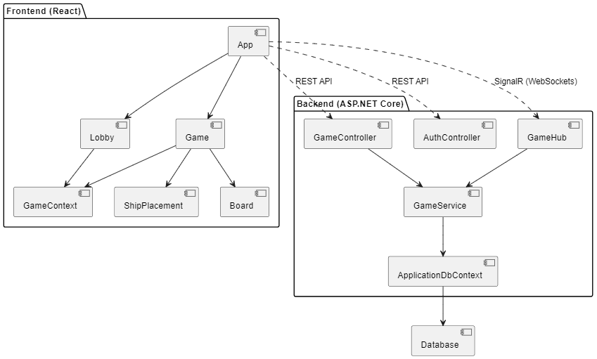
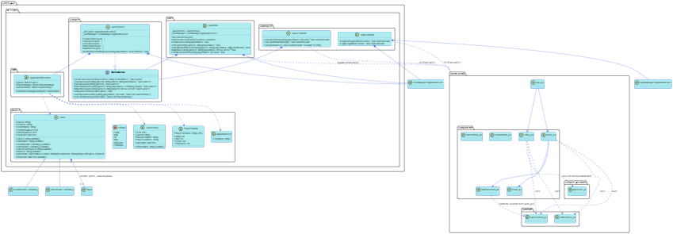

# 6. Архитектура системы

## 6.1. Общее описание

Система "Морской бой" построена по многокомпонентной архитектуре, предназначенной для контейнеризации и развертывания с помощью Docker.

### Диаграмма компонентов системы

*   **Клиент (Frontend):** Одностраничное веб-приложение (SPA), разработанное с использованием React. Отвечает за пользовательский интерфейс, взаимодействие с пользователем (регистрация, вход, лобби, расстановка кораблей, игровой процесс), отображение игровой информации и взаимодействие с бэкендом через HTTP API и SignalR.
*   **Сервер (Backend):** Приложение на ASP.NET Core, которое реализует бизнес-логику игры, управляет состоянием игр, обрабатывает аутентификацию пользователей, взаимодействует с базой данных и обеспечивает обмен данными в реальном времени с клиентами через SignalR.
*   **База данных (Database):** PostgreSQL, используемая для хранения информации о пользователях (`User`), истории игр (`GameHistory`) и рейтингах игроков (`PlayerRanking`). Взаимодействие с БД осуществляется через Entity Framework Core.
*   **Веб-сервер для фронтенда (Web Server for Frontend):** Nginx, используется для обслуживания статических файлов собранного React-приложения в Docker-контейнере.

Все эти компоненты оркестрируются с помощью Docker Compose.

## 6.2. Компоненты Бэкенда (ASP.NET Core Service - `server`)

### Диаграмма классов серверной части

*   **Контроллеры API (API Controllers):** Обрабатывают HTTP-запросы от клиента (например, `AuthController` для регистрации/входа, `GameController` для получения списка лидеров). Предоставляют RESTful эндпоинты.
*   **SignalR Хабы (`GameHub`):** Обеспечивают двунаправленную связь в реальном времени между клиентом и сервером для игрового процесса: создание/присоединение к игре, уведомления об изменениях в лобби, передача ходов, обновление состояния досок, объявление результатов игры, расстановка кораблей и подтверждение готовности.
*   **Сервисы (`GameService`, `IGameService`):** Содержат основную бизнес-логику приложения: создание и управление играми, обработка выстрелов, обновление состояния игры, управление историей игр и рейтингом игроков.
*   **Модели Данных (Models/Entities):** Определяют структуру данных, используемую в приложении и для отображения в базу данных (например, `ApplicationUser`, `GameHistory`, `PlayerRanking`). Модель `Game` используется для представления состояния текущей игры в памяти сервера.
*   **Контекст Базы Данных (`ApplicationDbContext`):** Класс, производный от `DbContext` EF Core, обеспечивающий сеанс работы с базой данных PostgreSQL (запросы, сохранение изменений).
*   **Механизм Миграций (EF Core Migrations):** Используется для управления схемой базы данных и ее обновлениями.
*   **Аутентификация и Авторизация:** Реализована с помощью ASP.NET Core Identity.

## 6.3. Компоненты Фронтенда (React SPA - `client`)

*   **Компоненты React (Components):** Модульные и переиспользуемые элементы UI, отвечающие за отображение и взаимодействие (например, `Lobby.jsx`, `Game.jsx`, `ShipPlacement.jsx`, `Login.jsx`, `Register.jsx`, `GameBoard.jsx`).
*   **Контексты React (Contexts):** `AuthContext` (управление состоянием аутентификации и информацией о пользователе), `SignalRContext` (управление SignalR соединением), `GameContext` (управление состоянием текущей игры, взаимодействие с `GameHub` через `SignalRContext`).
*   **Маршрутизация (Routing):** `react-router-dom` (v6) используется для навигации между различными представлениями/страницами SPA (например, `/login`, `/register`, `/home`, `/game/:gameId`).
*   **Взаимодействие с API и SignalR:** Логика взаимодействия с бэкендом инкапсулирована в функциях внутри контекстов или специфических хуков/сервисов. Используется `fetch` для HTTP-запросов и клиентская библиотека `@microsoft/signalr`.
*   **Стилизация (Styling):** CSS-файлы для каждого компонента, глобальные стили в `index.css` и `App.css`. Используются CSS переменные и шрифт "Nunito" для единого стиля.
*   **Сборка:** Vite используется для сборки статических ассетов React-приложения, которые затем обслуживаются Nginx.

## 6.4. База данных (PostgreSQL - `db`)

*   **Таблицы:**
    *   `Users`: Хранит информацию о пользователях (стандартная таблица ASP.NET Core Identity).
    *   `GameHistories`: Хранит записи о завершенных играх.
    *   `PlayerRankings`: Хранит рейтинг и статистику игроков.
*   Доступ к данным осуществляется бэкенд-сервисом через EF Core.

## 6.5. Взаимодействие компонентов в Docker-окружении

1.  **Запуск:** `docker compose up` запускает все три сервиса: `db`, `server`, `client`.
2.  **Сервер (`server`):** Ожидает готовности `db`, применяет миграции EF Core, запускает Kestrel и слушает HTTP-трафик (например, на порту 8080 внутри Docker-сети).
3.  **Клиент (`client`):** Nginx в контейнере `client` обслуживает статические файлы React-приложения (например, на порту 80 или другом, проброшенном наружу).
4.  **Пользователь:** Открывает в браузере адрес, на котором доступен `client` (Nginx).
5.  **Взаимодействие:**
    *   React-приложение выполняет HTTP-запросы к `server` (например, `http://localhost:PORT_SERVER_API/api/...`) для аутентификации, получения данных лобби и т.д. Docker Compose обеспечивает разрешение имен сервисов.
    *   Для real-time взаимодействия React-приложение устанавливает SignalR соединение с `server` (например, `http://localhost:PORT_SERVER_API/gamehub`).
    *   `server` обрабатывает запросы, взаимодействует с `db` (PostgreSQL) для чтения/записи данных.

## 6.6. Диаграммы
