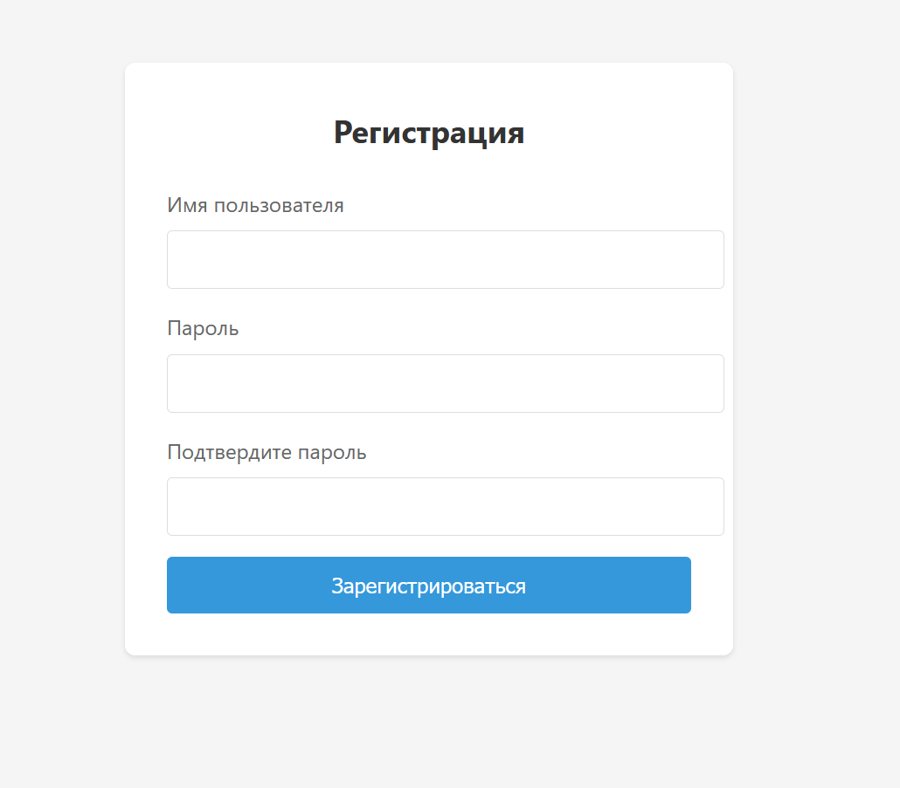
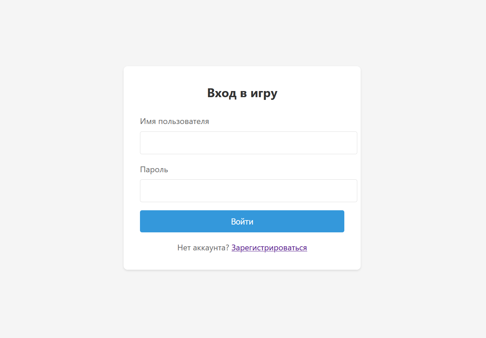
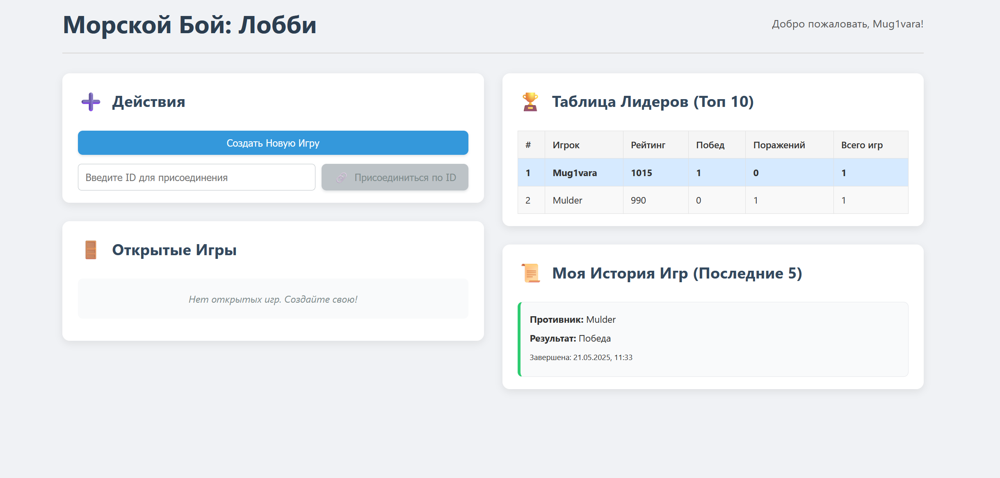
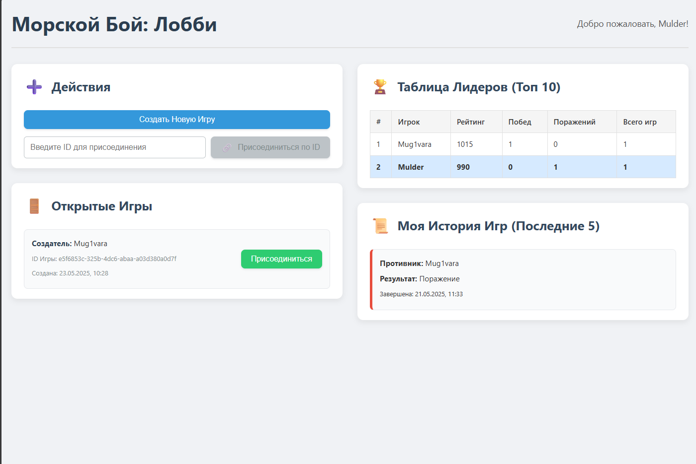
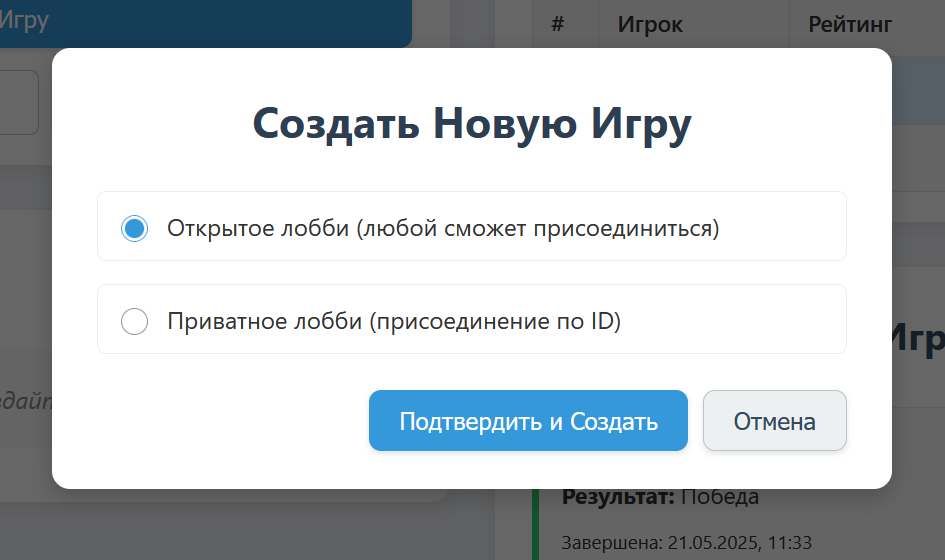
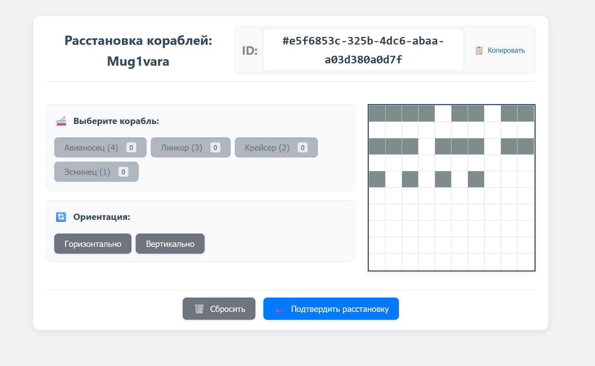
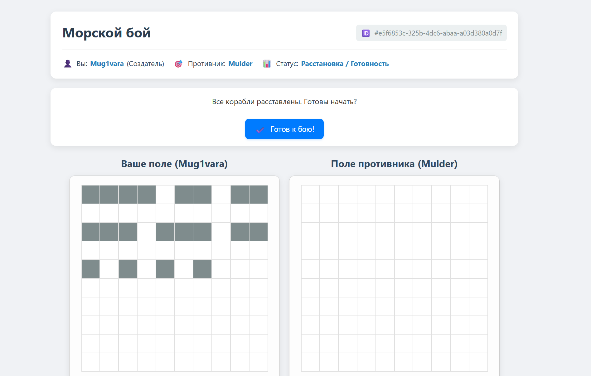
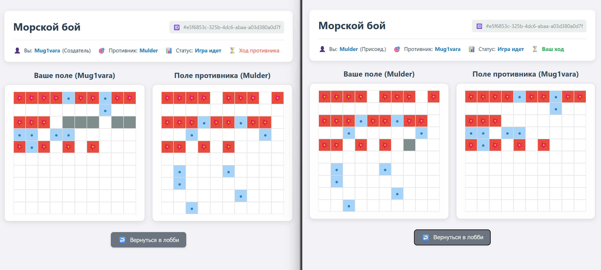
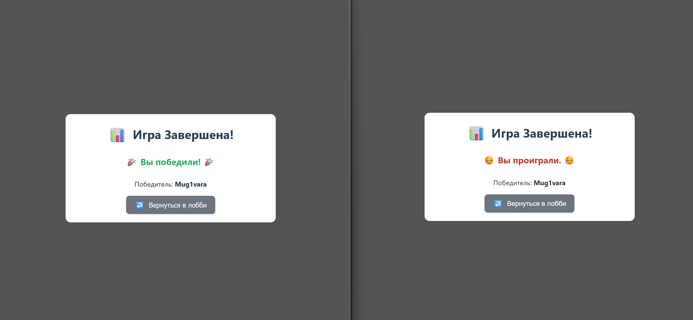

# 8. Руководство пользователя

Данное руководство поможет пользователям понять, как взаимодействовать с веб-приложением "Морской бой".

## 8.1. Начало работы

### 8.1.1. Доступ к приложению

1.  Убедитесь, что у вас установлен Docker и Docker Compose.

2.  Запустите проект с помощью команды `docker compose up --build` в корневой директории проекта (подробнее см. раздел `07_Deployment_And_Setup.md`).

3.  Откройте веб-браузер (например, Chrome, Firefox) и перейдите по адресу, на котором доступен клиент (обычно `http://localhost` или порт, указанный в `docker-compose.yml` для сервиса `client`).

### 8.1.2. Регистрация нового аккаунта

1.  На стартовой странице вы увидите опции для входа и регистрации.

2.  Нажмите на ссылку/кнопку "Зарегистрироваться".

3.  Заполните форму регистрации:

    *   **Имя пользователя (Username):** Придумайте уникальное имя, которое будет отображаться в игре и таблице лидеров.

    *   **Пароль (Password):** Введите надежный пароль.

    *   **Подтверждение пароля (Confirm Password):** Повторите введенный пароль для проверки.

4.  Нажмите кнопку "Зарегистрироваться".

5.  В случае успеха, вы будете автоматически аутентифицированы и перенаправлены на главную страницу приложения – Лобби.

6.  Если возникнет ошибка (например, имя пользователя уже используется или пароли не совпадают), на экране появится соответствующее сообщение.

### 8.1.3. Вход в существующий аккаунт

1.  На стартовой странице выберите опцию "Войти".

2.  Заполните форму входа:

    *   **Имя пользователя (Username):** Введите ваше имя пользователя.

    *   **Пароль (Password):** Введите ваш пароль.

3.  Нажмите кнопку "Войти".

4.  При успешном входе вы будете перенаправлены в Лобби.

5.  В случае ошибки (неверные учетные данные) появится сообщение.

### 8.1.4. Выход из аккаунта

*   В навигационной панели (шапке сайта) найдите кнопку "Выйти".

*   Нажмите на нее. Ваш сеанс будет завершен, и вы будете перенаправлены на страницу входа/регистрации.

## 8.2. Лобби

Лобби – это ваш командный центр. Отсюда вы можете начинать новые игры, присоединяться к существующим, просматривать свою статистику и рейтинг других игроков.

### 8.2.1. Создание новой игры

1.  В разделе "Создать игру" нажмите кнопку "Создать новую игру".

2.  Игра будет создана, и вы автоматически перейдете на экран игры. Ваш статус будет "Ожидание противника".

3.  Созданная вами игра также появится в разделе "Открытые лобби" для других игроков.

### 8.2.2. Присоединение к существующей игре

1.  В разделе "Открытые лобби" вы увидите список игр, созданных другими пользователями и ожидающих второго игрока.

2.  Для каждой игры отображается имя создателя.

3.  Нажмите кнопку "Присоединиться" рядом с интересующей вас игрой.

4.  Вы будете подключены к игре и перейдете на игровой экран.

### 8.2.3. История ваших игр

*   На странице лобби отображается секция "Моя история игр".

*   Здесь вы найдете список ваших последних сыгранных партий.

*   Для каждой игры указывается: ваш противник, результат (Победа/Поражение) и дата игры.

### 8.2.4. Таблица лидеров (Рейтинг игроков)

*   На странице лобби также доступна "Таблица лидеров".

*   В ней представлены лучшие игроки по текущему рейтингу.

*   Для каждого игрока в таблице отображается: Имя, Рейтинг, Количество побед, Количество поражений, Общее количество игр.

## 8.3. Игровой процесс

После того как два игрока (создатель и присоединившийся) окажутся в одной игре, начинается сам процесс игры, состоящий из нескольких этапов.

### 8.3.1. Этап 1: Расстановка кораблей

1.  **Переход к расстановке:** Сразу после входа второго игрока (или если вы присоединились к игре), вы перейдете на экран расстановки кораблей.

2.  **Интерфейс расстановки:**

    *   Вам будет представлено ваше игровое поле (сетка 10x10).

    *   Панель со списком доступных кораблей (1x Четырехпалубный, 2x Трехпалубных, 3x Двухпалубных, 4x Однопалубных) и их оставшимся количеством для размещения.

    *   Кнопка для изменения ориентации текущего выбранного корабля (Горизонтальная/Вертикальная).

3.  **Процесс размещения:**

    *   Выберите тип корабля из списка.

    *   Выберите его ориентацию.

    *   Кликните на ячейку на вашем поле, где должна начинаться "голова" корабля (верхняя или левая его часть).

    *   Корабль будет отображен на поле, если размещение возможно.

    *   Система не позволит разместить корабль, если он выходит за пределы поля или касается/пересекается с уже размещенными кораблями (корабли должны быть окружены пустыми клетками со всех сторон, включая диагонали).

4.  **Управление расстановкой:**

    *   **"Сбросить корабли" / "Очистить поле":** Кнопка для удаления всех размещенных кораблей с вашего поля, чтобы начать расстановку заново.

    *   **"Подтвердить расстановку" / "Готов к размещению":** После того как все корабли размещены корректно, нажмите эту кнопку. Ваша конфигурация поля будет отправлена на сервер, и флаг `CreatorBoardSet` или `JoinerBoardSet` (в зависимости от вашей роли) будет установлен.

5.  **Ожидание противника:** После подтверждения своей расстановки, вы будете ожидать, пока ваш оппонент сделает то же самое. Статус игры будет "Расстановка / Готовность".

### 8.3.2. Этап 2: Подтверждение готовности к бою

1.  **Условие:** Этот этап наступает после того, как оба игрока успешно разместили свои корабли и подтвердили их расстановку (оба флага `CreatorBoardSet` и `JoinerBoardSet` установлены).

2.  **Действие:** На экране появится кнопка "Готов к бою!" (или аналогичная).

3.  Нажмите эту кнопку, чтобы подтвердить свою готовность начать сражение. Ваш флаг готовности (`CreatorReady` или `JoinerReady`) будет установлен.

4.  **Ожидание противника:** Если вы подтвердили готовность, а противник еще нет, вы увидите сообщение "Вы готовы. Ожидание готовности противника...".

### 8.3.3. Этап 3: Бой

1.  **Начало боя:** Игра переходит в состояние "Игра идет" после того, как оба игрока подтвердили свою готовность к бою.

2.  **Определение первого хода:** Система определяет, кто ходит первым (например, создатель игры или случайным образом).

3.  **Игровые доски:** На экране отображаются два поля:

    *   **"Ваше поле" (или "Мое поле"):** Здесь видны ваши корабли (обычно скрыты для противника, но вы видите их расположение) и отметки выстрелов, сделанных по вам противником (попадания, промахи).

    *   **"Поле противника":** Изначально это пустое поле 10x10. По нему вы делаете выстрелы. Результаты ваших выстрелов (попадания, промахи, потопленные корабли) будут отмечаться здесь.

4.  **Совершение выстрела:**

    *   Если наступил ваш ход (отображается индикатор "Ваш ход"), кликните по любой ранее не обстрелянной ячейке на "Поле противника".

    *   Ячейки, по которым уже был сделан выстрел, будут неактивны или помечены.

5.  **Результаты выстрела и их отображение:**

    *   **Промах:** Ячейка на поле противника отмечается специальным символом (например, точка или `🚫`). Ход немедленно переходит к противнику. Появляется сообщение "Промах!".

    *   **Попадание (Ранен):** Если выстрел попал в часть многопалубного корабля, но не уничтожил его. Ячейка отмечается символом попадания (например, `💥` или красный крест). Вы получаете право на следующий ход. Появляется сообщение "Ранен!" или "Попадание!".

    *   **Потопил (Уничтожен):** Если выстрел пришелся в последнюю целую палубу корабля (или в однопалубный корабль). Весь корабль отмечается как потопленный (например, обводится контуром, и все его палубы помечаются как попадания). Все ячейки вокруг потопленного корабля автоматически отмечаются как "промахи", так как по правилам там не может быть других кораблей. Вы получаете право на следующий ход. Появляется сообщение "Потопил!" или "Уничтожен!".

6.  **Индикация хода:** Четко отображается, чей сейчас ход.

7.  **Обновление в реальном времени:** Все действия и их результаты мгновенно отображаются у обоих игроков благодаря SignalR.

### 8.3.4. Окончание игры

1.  Игра автоматически завершается, когда один из игроков уничтожает все корабли противника.

2.  **Оповещение:** На экране появляется сообщение о результате игры: "🎉 Вы победили! 🎉" или "😔 Вы проиграли. 😔". Также отображается имя победителя.

3.  **Обновление статистики:** Результаты игры (победа/поражение) сохраняются в вашей истории игр, и ваш рейтинг (а также рейтинг противника) обновляется.

4.  **Возврат в Лобби:** После отображения результатов становится активной кнопка "Вернуться в лобби".

## 8.4. Выход из игры / Возврат в Лобби

*   На игровом экране всегда доступна кнопка "Вернуться в лобби".

*   Если вы покидаете игру до ее официального завершения (когда один из игроков победил), это может быть засчитано как техническое поражение, и ваш рейтинг может быть понижен.

*   После завершения игры, нажатие этой кнопки вернет вас на страницу Лобби.
