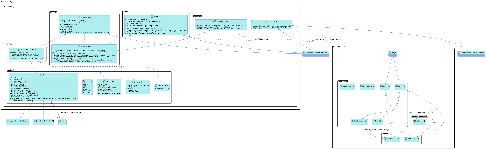
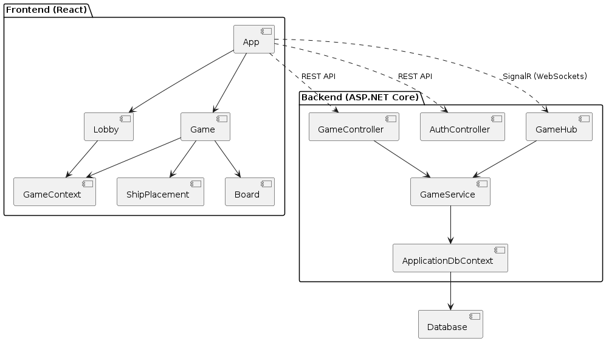
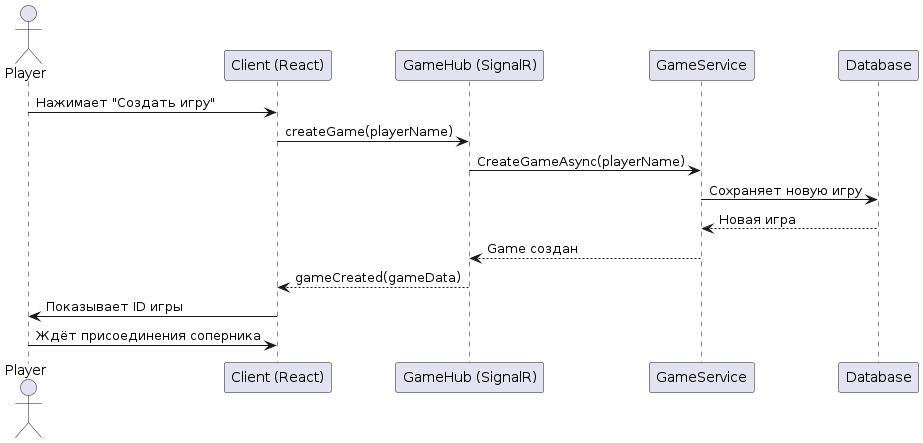
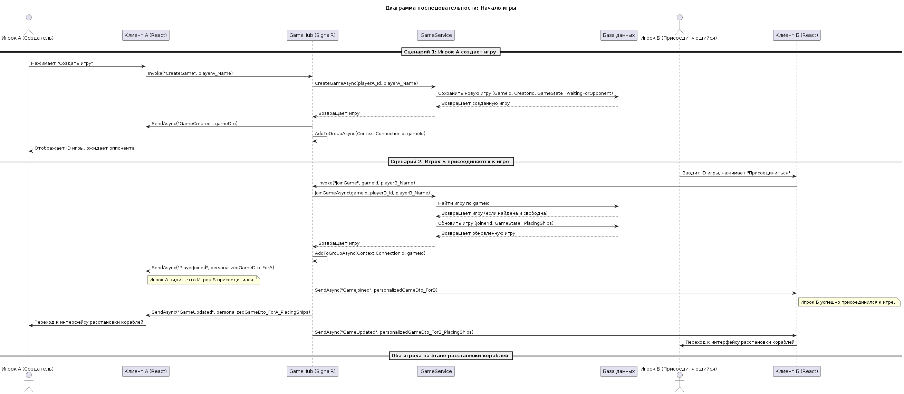
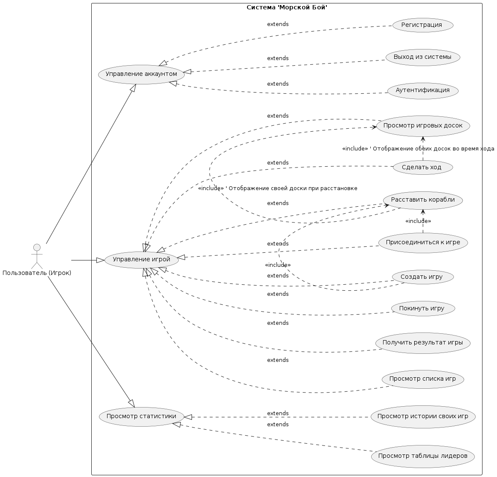

# Документация проекта SeaBattle

## Содержание

### 1. Основная документация
- [Техническая спецификация](00_Technical_Specification.md)
- [Назначение проекта](01_Project_Purpose.md)
- [Пользователи и бизнес-процессы](02_Users_And_Business_Processes.md)
- [Функциональные требования](03_Functional_Requirements.md)
- [Системные требования](04_System_Requirements.md)
- [Инструменты разработки](05_Development_Tools.md)
- [Системная архитектура](06_System_Architecture.md)

### 2. Развертывание и эксплуатация
- [Развертывание и настройка](07_Deployment_And_Setup.md)
- [Руководство пользователя](08_User_Manual.md)
- [Анализ рисков](09_Risk_Analysis.md)
- [План внедрения](10_Deployment_Plan.md)
- [План разработки](11_Development_Plan.md)

### 3. Тестирование
- [Тестирование](TESTS.md)

### 4. Дополнительные материалы
- [Изображения](img/)
- [Диаграммы](diagrams/)

## UML Diagrams

### ClassDiagram

### ComponentOverview

### SequenceCreateGame

### SequenceGameStart

### UseCaseDiagram

